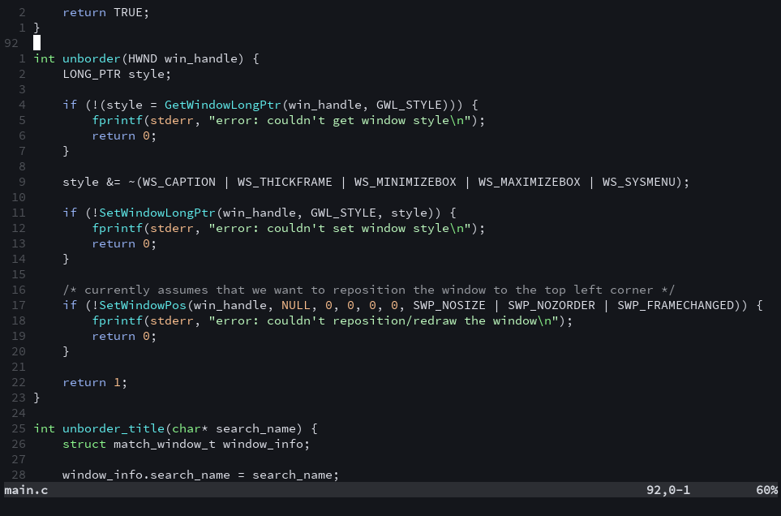

# neato.vim

neato is a colorscheme for vim based on the default neovim colorscheme with some extra colors added.



Install via your preferred plugin manager or manually clone:

```bash
# Replace "manual" with whatever namespace you prefer:
git clone https://github.com/davidscholberg/neato.vim.git ~/.vim/pack/manual/start/neato.vim
```

Add the following to your `.vimrc` (the `g:neato_hl_func_calls` variable is optional and merely adds highlighting for function calls to languages that don't do it by default):

```vim
let g:neato_hl_func_calls = 1
colorscheme neato
```
